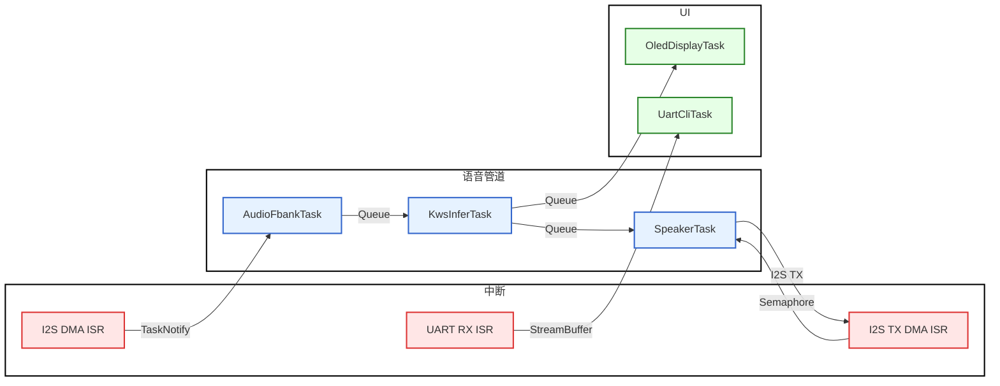

**基于 STM32与 FreeRTOS的 AI 智能语音助手**

#### 项目简介

随着人工智能在边缘计算领域的不断发展，轻量化 AI 模型在资源受限的嵌入式设备上的性能越来越强大。本项目实现了一套基于 STM32+FreeRTOS 的离线语音助手系统。系统集成关键词唤醒（Keyword Spotting，KWS）算法，支持离线语音触发与交互，
并实现了语音播报、音乐播放及系统状态显示等功能。设备通过屏幕实时展示系统运行信息，同时提供串口CLI 调试接口，便于开发
调试与功能扩展。

以下是各个模块的详细介绍：

- **语音交互模块**：采用 Keyword Spotting (KWS) 技术实现。基于开源WeKWS框架完成关键词检测模型训练，通过实验选择适合嵌入式推理的轻量化Backbone，并对训练及推理部分代码进行了修改。模型训练完成后，利用STM32Cube.AI将**PyTorch**模型转换为STM32可运行的推理代码，并部署到MCU端，实现**离线语音关键词检测与唤醒**功能。

  开发细节介绍：该KWS模型是我使用[wekws](https://github.com/wenet-e2e/wekws)框架训练的。wekws是一个面向生产的语音关键词检测领域的开源工具包，集成了一些常见网络如FSMN，MDTC等和损失函数Maxpooling Loss，CTC Loss等，可以较为方便的训练自己的网络并部署到android，raspberrypi上或者是导出为onnx。由于之前在课题组里积累了一些深度学习的经验，所以让我能较快的上手这个工具包。经过我一段时间的使用，我发现里面现成的网络并不适合MCU的需求，训练出来模型的参数量都超过了STM32的存储容量。虽然我尝试过优化，但是效果均不好，模型剪枝我接触的较少，所以重点就放在了量化上，但是经过一段时间的尝试，我发现stm32的部署工具x-cube-ai是不支持像int8 onnx这样的输入的，只能输入FP32的模型。所以最后的优化方向就是换用小参数量网络，在一段时间的寻找后，我在一篇博客中看到了DSCNN的实际使用，于是我将它的网络架构写入wekws，并把网络的输出改为了帧级输出，适配训练流程。最后训练出来的效果也还行，模型参数量小了很多，只有20K，导出为onnx大小为80KB，同样RAM占用也很小，仅20KB。

  下面是wekws的介绍，wekws [paper](https://arxiv.org/pdf/2210.16743.pdf)

> Production First and Production Ready End-to-End Keyword Spotting Toolkit.
>
> The goal of this toolkit it to...
>
> Small footprint keyword spotting (KWS), or specifically wake-up word (WuW) detection is a typical and important module in internet of things (IoT) devices. It provides a way for users to control IoT devices with a hands-free experience. A WuW detection system usually runs locally and persistently on IoT devices, which requires low consumptional power, less model parameters, low computational comlexity and to detect predefined keyword in a streaming way, i.e., requires low latency.

- **语音输入输出模块**：采用INMP441来实现音频采集，使用MAX98357来输出存放在W25Q16中的音频。

  开发细节介绍：INMP441是一个24bits的MEMS麦克风，输出的是PCM波，通过I2S协议输入到I2S芯片。需要具体的理解I2S协议的工作方式，STM32的I2S_DMA的工作特性，INMP441的基本原理，才能顺利实现数据的正确处理。我设计了一个DMA双缓冲(ping pong缓冲)的机制，来处理实时音频流。将原始的音频数据转成常见的16bits格式，也是为了适配模型的输入。音频数据的Fbank特征提取我参考了ST官方的C代码，并修改了相关的参数，并将它移植到此项目上。系统的输出使用喇叭来播放音频，读取SPI存储芯片中的内容并播放，W25Q64的驱动代码我参考了网上开发板例程中的代码，并将其移植到我的项目中。

- **OLED显示模块**：使用**I2C**协议驱动OLED屏，用来实时展示系统运行状态与语音助手工作信息。

  开发细节介绍：OLED屏幕驱动来自[江协科技](https://jiangxiekeji.com/)，原本的OLED驱动是基于标准库的，我将其稍作修改，便可应用于HAL库。一共是设计了**三个**界面：1）启动界面2）主界面（用于显示模型正在listening）3）检测界面：用于提示模型已经检测到了关键词。

- **串口CLI模块**：设计并实现基于**UASRT**的**命令行接口(CLI)**，支持运行时调试，系统状态查询与功能控制。

  开发细节介绍：使用串口来实现一个简单的命令行，目前支持5条命令：help，status，heap，model，burn。原理是通过串口调试工具将命令发送到MCU端，MCU端解析命令并调用相应的函数返回信息。可以较为方便的在线调试系统。

- **基于FreeRTOS构建**：采用**FreeRTOS**构建实时操作系统架构，通过多任务调度实现语音处理与外设控制的并行执行。根据系统功能划分多个独立任务，并利用**队列与事件机制**完成任务间通信，使音频采集、AI 推理、音频播放和用户交互能够协同运行

  开发细节介绍：由于任务较多，采用裸机不好管理各个任务之间的协调，故加入了FreeRTOS来管理。我一共是设计了5个任务，分别是音频输入任务、模型推理任务、OLED显示任务、语音播报任务、串口CLI任务。并将音频输入任务优先级设置为最高，避免因其他任务抢占而导致的丢失音频输入的问题，推理任务优先级其次，保证模型能够正常推理。借助FreeRTOS提供的**队列**，**任务通知**，**StreamBuffer**，**二值信号量**，可以非常合理且方便的设计系统。

#### 系统的处理逻辑图



#### 项目结构

```
ai--存放模型训练代码
Firmware--存放keil项目代码
Hardware--存放嘉立创项目文件（待做）
model--模型文件
```

#### 项目所使用的材料

STM32F407VGT6最小系统板

GME12364 0.96英寸OLED显示屏

INMP441 MEMS麦克风

830孔面包板

MAX98357功放芯片

8 $\Omega$ 2 W 喇叭

若干杜邦线

待做：将硬件整合到开发板上，设计PCB

